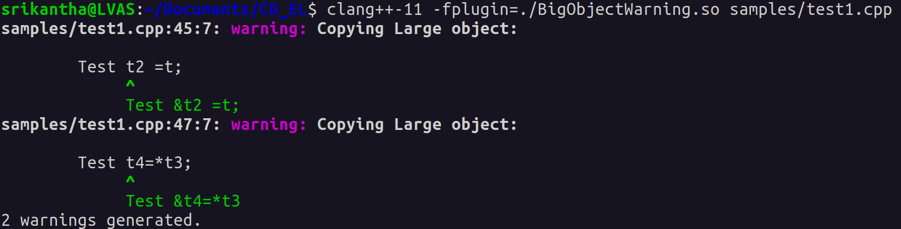
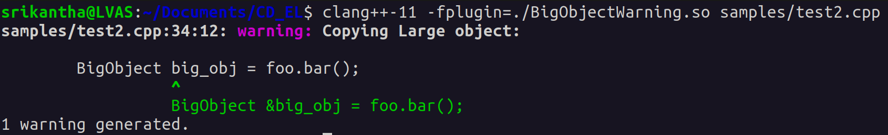

# Clang Plugin For Big Object Copy Warning

This is a clang plugin which is developed to provide diagnostic Warning for the copy of big object and suggesting to 
use reference instead of copy of object. Here the threshold is taken as 20 bytes.

First the plugin has to be built, following are the requirements for the same

- Clang ( here we have used clang-11)

    For Installation of clang in ubuntu 

    ```
        sudo apt-get install clang-11
    ```
- llvm

    For Installation, refer the [Documentation](https://llvm.org/)


## Demonstration

For Demonstration, A sample C++ files are created, which are present
in [samples](samples). 

First the plugin has to be built using the command
```bash``` command
```
    cmake -build .    
```
For execution, use the command
```bash``` command
```
    clang++-11 -fplugin=./BigObjectWarning.so <source file path>
```


    
## Screenshots



